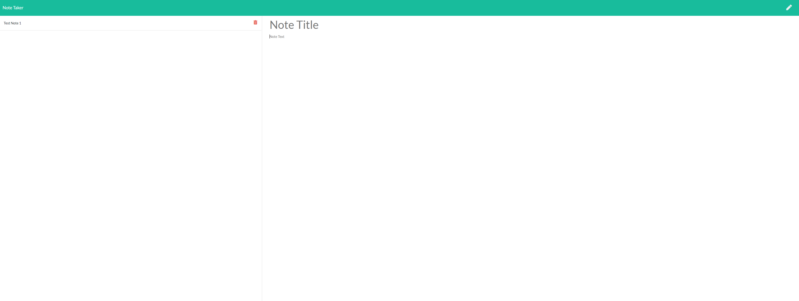

## Live Deploy
https://northwestern-note-taking-app.herokuapp.com/

# Note Taker

# Contact
Vygoth
JeremyJoanet@protonmail.com

## Description
This application allows you to create notes that are stored to a database, you can view or delete those notes after they are created.

## Table of Contents
- [Usage](#Usage)
- [Credits](#Credits)
- [Screenshot](#Screenshot)

## Usage
This application is available as a live deployed application, link at the top of the README.

## Credits
Matt Reisdorf, Tom Siemion, Zach Duty. 

## Screenshot

